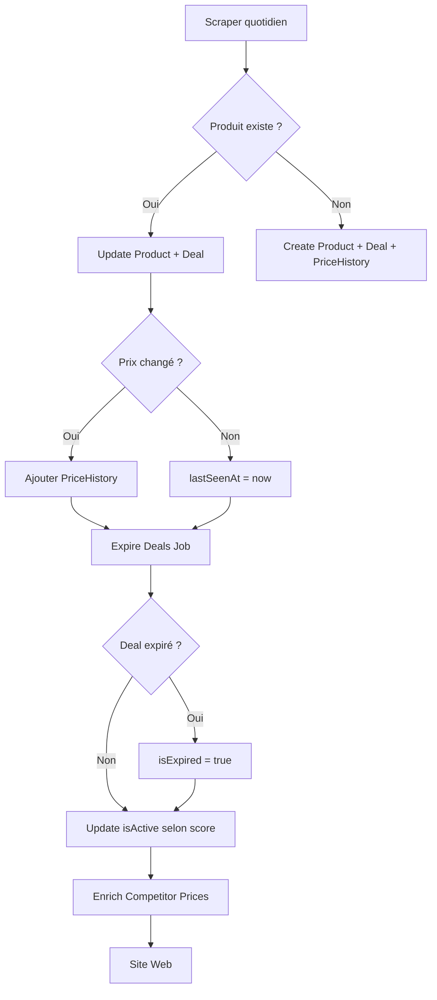

# 📊 GESTION DES PRIX - City Baddies

## Vue d'ensemble

Le système de gestion des prix de City Baddies est basé sur un pipeline multi-étapes qui scrappe, analyse, stocke et met à jour les prix en continu.

---

## 🗄️ Structure de la Base de Données

### Tables concernées par les prix

#### 1. **Product** (Fiche produit immuable)
- **Rôle** : Contient les informations fixes du produit
- **Champs liés aux prix** : AUCUN directement
- **Relations** : 
  - Lié à `PriceHistory` pour suivre l'évolution des prix
  - Lié à `Deal` pour les promotions actives

#### 2. **ProductVariant** (Variantes de contenances)
- **Rôle** : Gère les différentes tailles d'un même produit (50ml, 100ml, etc.)
- **Champs** :
  ```prisma
  volumeValue   Float    // Ex: 50, 100, 200
  volumeUnit    String   // "ml", "g", "l", "kg"
  volumeRaw     String?  // "50 ML" (volume brut original)
  ean           String?  // Code-barres spécifique à la variante
  ```
- **Note** : Système en migration progressive, pas encore obligatoire

#### 3. **PriceHistory** (Historique des prix)
- **Rôle** : Conserve l'historique complet des prix pour chaque produit
- **Champs** :
  ```prisma
  productId String   // Lien vers Product
  price     Float    // Prix capturé
  date      DateTime // Date de capture
  ```
- **Indexation** : `productId` et `date` pour requêtes rapides
- **Création** :
  - ✅ Lors de la création d'un nouveau produit (prix initial)
  - ✅ Lors de chaque changement de prix détecté (si prix différent du dernier enregistré)

#### 4. **Deal** (Promotions éphémères)
- **Rôle** : Représente une offre promotionnelle active
- **Champs de prix** :
  ```prisma
  dealPrice       Float    // Prix promotionnel actuel
  originalPrice   Float    // Prix de référence (barré)
  discountPercent Int      // % de réduction
  discountAmount  Float    // Montant de la réduction (€)
  pricePerUnit    Float?   // Prix par unité (€/ml ou €/g)
  ```
- **Champs de gestion** :
  ```prisma
  score           Float      // Score global (0-100) - détermine isActive
  isExpired       Boolean    // Promo terminée
  isActive        Boolean    // Deal visible sur le site (score >= 60 et non expiré)
  lastSeenAt      DateTime   // Dernière fois vu en scraping
  ```
- **Volume** (en migration) :
  ```prisma
  variantId       String?              // Lien vers ProductVariant (nouveau)
  volume          String?   @deprecated // "50 ml" (ancien, sera supprimé)
  volumeValue     Float?    @deprecated // 50
  volumeUnit      String?   @deprecated // "ml"
  ```

#### 5. **CompetitorPrice** (Prix des concurrents)
- **Rôle** : Compare les prix d'un même produit chez différents marchands
- **Champs** :
  ```prisma
  dealId          String   // Lien vers Deal
  merchantId      String   // Marchand concurrent
  merchantName    String   // "Sephora", "Nocibé", etc.
  productName     String   // Nom du produit trouvé
  productUrl      String   // URL chez le concurrent
  currentPrice    Float    // Prix actuel
  originalPrice   Float?   // Prix barré (si promo)
  discountPercent Int?     // % de réduction
  volume          String?  // Contenance
  inStock         Boolean
  lastChecked     DateTime
  ```

---

## 🔄 Pipeline de Gestion des Prix

### Étape 1 : Scraping Initial (Jobs quotidiens)

**Scripts** : `scrape-sephora.ts`, `scrape-nocibe.ts`, `scrape-marionnaud.ts`

**Processus** :
```typescript
// 1. Récupère le merchant (ex: Sephora)
const merchant = await getOrCreateMerchant('sephora');

// 2. Récupère les ScrapingSource (URLs à scraper)
const sources = await prisma.scrapingSource.findMany({
  where: { merchantId: merchant.id, isActive: true }
});

// 3. Pour chaque source, scrappe les produits
for (const source of sources) {
  const products = await scraper.scrape(source.url);
  // products contient: name, brand, volume, currentPrice, originalPrice, etc.
}
```

**Données scrapées** :
```typescript
interface ScrapedProduct {
  name: string;
  brand: string;
  volume: string;           // Ex: "50 ml"
  currentPrice: number;     // Prix actuel (promotionnel ou non)
  originalPrice: number;    // Prix de référence (barré)
  discountPercent: number;  // % calculé
  imageUrl: string;
  productUrl: string;
  category: string;         // Catégorie de la source
  isTrending: boolean;      // Si source type="trending"
}
```

---

### Étape 2 : Import dans la Base (ImportEngine)

**Fichier** : `ImportEngine.ts`

#### 2.1 Séparation Existants vs Nouveaux

```typescript
// Recherche par URL (critère infaillible)
const existingByUrl = await prisma.product.findMany({
  where: { productUrl: { in: productUrls } },
  include: { deals: true }
});

// Fallback: recherche par nom + marque
const existingByName = await prisma.product.findMany({
  where: { merchantId, name: { in: productNames } }
});

// Si trouvé mais volume différent -> considéré comme nouveau produit
```

#### 2.2 Mise à jour des Produits Existants

```typescript
async updateExistingProducts(products) {
  for (const product of products) {
    // 1. Mettre à jour les infos produit
    await prisma.product.update({
      data: {
        imageUrl: product.imageUrl,
        productUrl: product.productUrl
      }
    });

    // 2. Créer/trouver la variante de volume
    const variant = await findOrCreateVariant(productId, product.volume);

    // 3. Mettre à jour le deal si discount >= minDiscountPercent (5% par défaut)
    if (existingDeal && product.discountPercent >= 5) {
      // FALLBACK: Recalculer originalPrice si incohérence
      if (originalPrice === currentPrice && discountPercent > 0) {
        originalPrice = currentPrice / (1 - discountPercent / 100);
      }
      
      const pricePerUnit = calculatePricePerUnit(currentPrice, volume);
      const scoreResult = calculateDealScore({
        discountPercent,
        brandTier,
        pricePerUnit,
        isHot,
        isTrending,
        categorySlug
      });

      await prisma.deal.update({
        data: {
          title: `${brand} -${discountPercent}% : ${name}`,
          dealPrice: currentPrice,
          originalPrice,
          discountPercent,
          discountAmount: originalPrice - currentPrice,
          variantId: variant?.id,
          pricePerUnit,
          score: scoreResult.score,
          tags: tagsToString(scoreResult.tags),
          isTrending,
          isExpired: false,
          lastSeenAt: new Date()  // ✅ Mise à jour importante !
        }
      });
    }

    // 4. PriceHistory: UNIQUEMENT si prix différent du dernier
    const lastPrice = await getLastPrice(productId);
    if (lastPrice !== currentPrice) {
      await prisma.priceHistory.create({
        data: {
          productId,
          price: currentPrice,
          date: new Date()
        }
      });
      priceChanges++;
    }
  }
}
```

**Points clés** :
- ✅ Le deal est mis à jour avec les nouvelles infos de prix
- ✅ `lastSeenAt` est mis à jour pour tracker que le deal existe toujours
- ✅ `PriceHistory` enregistre UNIQUEMENT si changement de prix
- ✅ Le score est recalculé (peut changer `isActive`)

#### 2.3 Création de Nouveaux Produits

```typescript
async createNewProducts(products) {
  // 1. Catégorisation AI (batch de 50)
  const classifications = await categorizeProductsBatch(products);

  // 2. Pour chaque produit
  await prisma.$transaction(async (tx) => {
    // Créer le produit
    const dbProduct = await tx.product.create({
      data: {
        name, slug, brand, brandId, categoryId,
        subcategory, subsubcategory,
        imageUrl, productUrl, merchantId
      }
    });

    // Créer la variante de volume
    const variant = await findOrCreateVariant(tx, productId, volume);

    // Créer le deal si discount >= 5%
    if (discountPercent >= 5) {
      const pricePerUnit = calculatePricePerUnit(currentPrice, volume);
      const scoreResult = calculateDealScore({...});

      await tx.deal.create({
        data: {
          productId,
          variantId: variant?.id,
          title: `${brand} -${discountPercent}% : ${name}`,
          refinedTitle: classification.refinedTitle,
          dealPrice: currentPrice,
          originalPrice,
          discountPercent,
          discountAmount: originalPrice - currentPrice,
          volume, volumeValue, volumeUnit,
          pricePerUnit,
          brandTier: classification.brandTier,
          score: scoreResult.score,
          tags: tagsToString(scoreResult.tags),
          isTrending,
          isExpired: false,
          lastSeenAt: new Date()
        }
      });
    }

    // PriceHistory initial
    await tx.priceHistory.create({
      data: {
        productId,
        price: currentPrice,
        date: new Date()
      }
    });
  });
}
```

---

### Étape 3 : Expiration des Deals (Job quotidien)

**Script** : `expire-deals.ts`

**Processus** :
```typescript
const activeDeals = await prisma.deal.findMany({
  include: {
    product: {
      include: {
        priceHistory: {
          orderBy: { date: 'desc' },
          take: 2  // Dernier et avant-dernier prix
        }
      }
    }
  }
});

for (const deal of activeDeals) {
  // ❌ CAS 1: Promo terminée (originalPrice = dealPrice)
  if (Math.abs(originalPrice - dealPrice) < 0.01) {
    changes.push({ changeType: 'PROMO_ENDED' });
  }

  // ❌ CAS 2: Hausse de prix >= 5%
  if (priceHistory.length >= 2) {
    const priceChange = (latestPrice - previousPrice) / previousPrice;
    if (priceChange >= 0.05) {
      changes.push({ changeType: 'PRICE_INCREASE' });
    }
  }

  // ❌ CAS 3: Non vu depuis X jours (défaut 7 jours)
  const daysSinceLastSeen = (now - deal.lastSeenAt) / (1000 * 60 * 60 * 24);
  if (daysSinceLastSeen >= DAYS_BEFORE_DELETION) {
    changes.push({ changeType: 'NOT_SEEN' });
  }
}

// Marquer comme expiré
await prisma.deal.updateMany({
  where: { id: { in: expiredIds } },
  data: { isExpired: true }
});
```

**Résultat** :
- ✅ Deals expirés si promo terminée, hausse de prix, ou non vus depuis 7 jours
- ✅ Baisses de prix GARDÉES (deals restent actifs)

---

### Étape 4 : Mise à jour de isActive (Manuel ou automatique)

**Script** : `update-is-active.ts`

**Logique** :
```typescript
// Désactiver: deals expirés ou score trop bas
await prisma.deal.updateMany({
  where: {
    OR: [
      { isExpired: true },
      { score: { lt: 60 } }  // Seuil configurable (défaut 60)
    ]
  },
  data: { isActive: false }
});

// Activer: deals non expirés avec score >= 60
await prisma.deal.updateMany({
  where: {
    isExpired: false,
    score: { gte: 60 }
  },
  data: { isActive: true }
});
```

**Critères `isActive = true`** :
- ✅ `isExpired = false`
- ✅ `score >= 60` (ou 50 selon configuration)

---

### Étape 5 : Enrichissement Prix Concurrents (Optionnel)

**Script** : `enrich-competitor-prices.ts`

**Processus** :
```typescript
// 1. Récupérer les deals avec score >= MIN_SCORE (défaut 5)
const deals = await prisma.deal.findMany({
  where: {
    score: { gte: MIN_SCORE },
    isExpired: false,
    volume: { not: null }
  },
  include: {
    product: { include: { merchant: true, brandRef: true } },
    competitorPrices: true
  },
  orderBy: { score: 'desc' },
  take: MAX_DEALS
});

// 2. Pour chaque deal, chercher chez les 2 concurrents
// Ex: Deal Nocibé -> chercher chez Sephora ET Marionnaud
for (const deal of deals) {
  const competitors = getCompetitors(deal.product.merchantId);
  
  for (const competitor of competitors) {
    // Utilise Serper API + Playwright + GPT-4o-mini Vision
    const result = await searchCompetitorPrice(
      deal.product.brand,
      deal.product.name,
      deal.volume,
      competitor.site
    );

    if (result.found) {
      await prisma.competitorPrice.upsert({
        where: { dealId_merchantId: { dealId: deal.id, merchantId: competitor.id } },
        update: {
          productName: result.productName,
          productUrl: result.productUrl,
          currentPrice: result.currentPrice,
          originalPrice: result.originalPrice,
          discountPercent: result.discountPercent,
          volume: result.volume,
          inStock: result.inStock,
          lastChecked: new Date()
        },
        create: { ... }
      });
    }
  }
}
```

**Résultat** :
- ✅ Chaque deal a 0 à 2 `CompetitorPrice` associés
- ✅ Permet de comparer les prix entre marchands
- ✅ Affichage sur le site : "Chez Sephora: 45€ (+5€)"

---

## 📈 Flux de Données Résumé



---

## 🔑 Points Clés à Retenir

### Champs Prix dans Deal

| Champ | Description | Source |
|-------|-------------|--------|
| `dealPrice` | Prix promotionnel actuel | Scrapé |
| `originalPrice` | Prix de référence (barré) | Scrapé ou recalculé |
| `discountPercent` | % de réduction | Calculé |
| `discountAmount` | Montant réduction (€) | Calculé |
| `pricePerUnit` | €/ml ou €/g | Calculé |
| `score` | Score global 0-100 | Calculé (scoring.ts) |
| `isActive` | Visible sur le site | Calculé (score >= 60 + non expiré) |
| `isExpired` | Promo terminée | Calculé (expire-deals.ts) |
| `lastSeenAt` | Dernière fois scrapé | Mis à jour à chaque scraping |

### PriceHistory

- ✅ Créé UNIQUEMENT lors de changement de prix
- ✅ Premier enregistrement lors de la création du produit
- ✅ Utilisé pour détecter hausses/baisses de prix
- ✅ Permet de tracer l'évolution des prix dans le temps

### isActive vs isExpired

| État | `isExpired` | `score` | `isActive` | Affiché sur le site |
|------|-------------|---------|------------|---------------------|
| Deal parfait | `false` | >= 60 | `true` | ✅ |
| Deal moyen | `false` | 50-59 | `false` | ❌ |
| Deal faible | `false` | < 50 | `false` | ❌ |
| Promo terminée | `true` | N/A | `false` | ❌ |

### Fréquence des Jobs

| Job | Fréquence | Rôle |
|-----|-----------|------|
| `scrape-*.ts` | Quotidien | Scrap + update prix |
| `expire-deals.ts` | Quotidien | Marque deals expirés |
| `update-is-active.ts` | Manuel/Post-scraping | Recalcule isActive |
| `enrich-competitor-prices.ts` | Hebdomadaire | Compare prix concurrents |

---

## 🛠️ Commandes Utiles

```bash
# Scraping
npx tsx src/scripts/cloud-jobs/scrape-sephora.ts
npx tsx src/scripts/cloud-jobs/scrape-nocibe.ts
npx tsx src/scripts/cloud-jobs/scrape-marionnaud.ts

# Gestion deals
npx tsx src/scripts/cloud-jobs/expire-deals.ts
npx tsx src/scripts/update-is-active.ts
npx tsx src/scripts/update-is-active.ts --threshold=50

# Prix concurrents
npx tsx src/scripts/cloud-jobs/enrich-competitor-prices.ts
```

---

## 🔍 Exemple de Cycle Complet

### Jour 1 (Lundi 10h)
```sql
-- Scraping Sephora trouve un nouveau deal
-- Produit: Chanel N°5 50ml
-- Prix: 89€ (original 120€, -26%)

INSERT INTO Product (...);
INSERT INTO Deal (
  dealPrice = 89,
  originalPrice = 120,
  discountPercent = 26,
  score = 75,
  isActive = true,
  isExpired = false,
  lastSeenAt = '2026-02-03 10:00:00'
);
INSERT INTO PriceHistory (price = 89, date = '2026-02-03 10:00:00');
```

### Jour 2 (Mardi 10h)
```sql
-- Scraping: Deal toujours présent, prix inchangé
UPDATE Deal SET lastSeenAt = '2026-02-04 10:00:00';
-- Pas de PriceHistory car prix identique
```

### Jour 3 (Mercredi 10h)
```sql
-- Scraping: Prix baissé à 79€ !
UPDATE Deal SET
  dealPrice = 79,
  discountPercent = 34,
  score = 82,  -- Score augmenté (meilleure promo)
  lastSeenAt = '2026-02-05 10:00:00';
INSERT INTO PriceHistory (price = 79, date = '2026-02-05 10:00:00');
```

### Jour 10 (Mercredi suivant 10h)
```sql
-- Scraping: Promo terminée (prix = 120€)
UPDATE Deal SET
  dealPrice = 120,
  originalPrice = 120,  -- Plus de différence
  discountPercent = 0,
  lastSeenAt = '2026-02-12 10:00:00';

-- Job expire-deals.ts détecte originalPrice = dealPrice
UPDATE Deal SET isExpired = true;

-- Job update-is-active.ts
UPDATE Deal SET isActive = false;  -- Plus visible sur le site
```

---

## 📝 Notes Importantes

### Migration en cours : ProductVariant
- Ancien système : `volume`, `volumeValue`, `volumeUnit` dans Deal
- Nouveau système : `variantId` pointant vers ProductVariant
- Transition progressive pour éviter les régressions

### Calcul du Score
Le score détermine `isActive` et la visibilité du deal. Facteurs :
- Discount % (poids le plus important)
- Brand Tier (1=Luxe, 2=Milieu, 3=Entrée)
- Prix/unité (favorise les grandes contenances économiques)
- isHot (votes >= 20)
- isTrending (réseaux sociaux)
- Catégorie/sous-catégorie (bonus pour certains types)

### Pourquoi 2 champs prix ?
- `dealPrice` : Prix affiché sur le site marchand
- `originalPrice` : Prix de référence (barré) pour calculer la réduction
- Si pas de promo : `dealPrice = originalPrice`

### CompetitorPrice : Optionnel
- Pas obligatoire pour afficher un deal
- Enrichissement progressif pour améliorer le comparatif
- Utilise Serper API (payant) + GPT-4o-mini Vision

---

## 🚨 Problèmes Fréquents

### "Mes deals ne s'affichent pas sur le site"
1. Vérifier `isActive = true` : `SELECT * FROM Deal WHERE isActive = false;`
2. Vérifier `score >= 60` : `SELECT * FROM Deal WHERE score < 60;`
3. Lancer manuellement : `npx tsx src/scripts/update-is-active.ts`

### "PriceHistory remplit trop la DB"
- ✅ Normal : seulement si prix change
- ❌ Si rempli à chaque scraping : bug dans `ImportEngine.updateExistingProducts()`

### "Deals marqués expirés alors qu'ils existent toujours"
- Vérifier `lastSeenAt` : si > 7 jours, le job expire-deals les marque expirés
- Cause probable : le scraper ne trouve plus le produit (URL changée, produit retiré, etc.)

---

**Dernière mise à jour** : 3 février 2026
